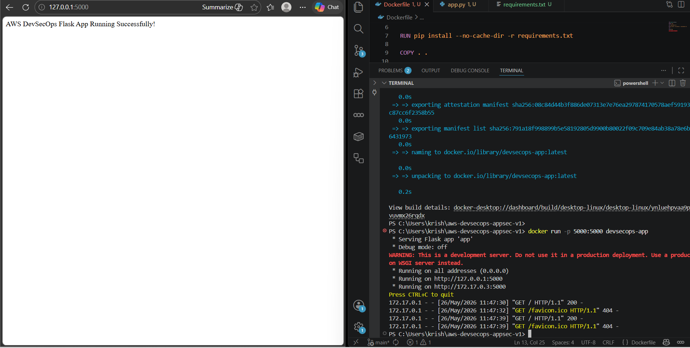
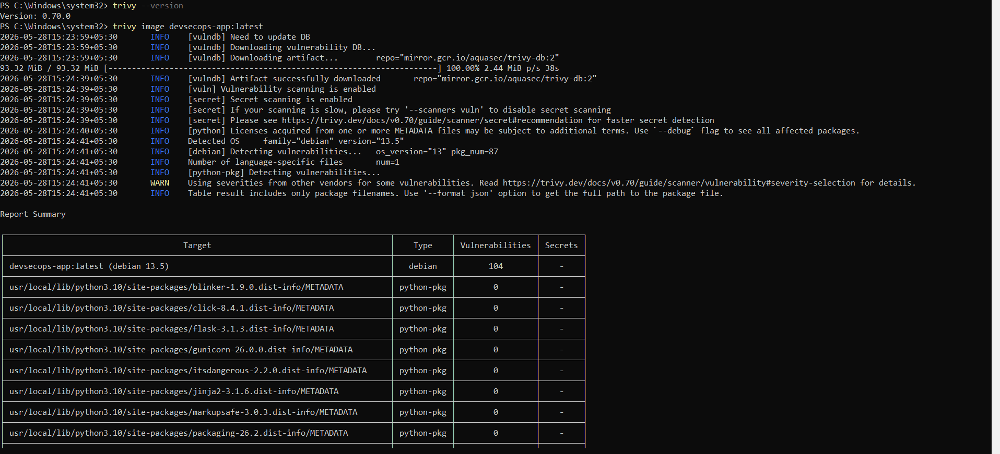
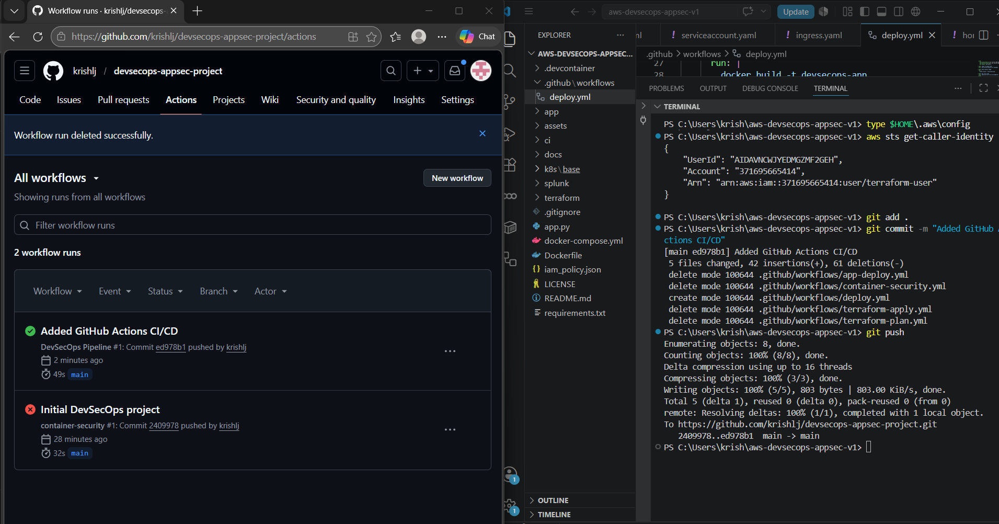
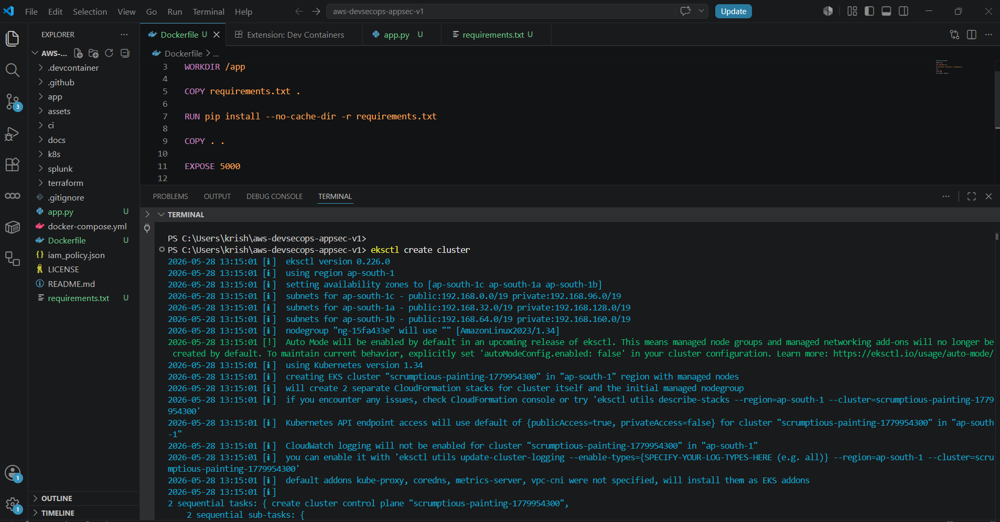
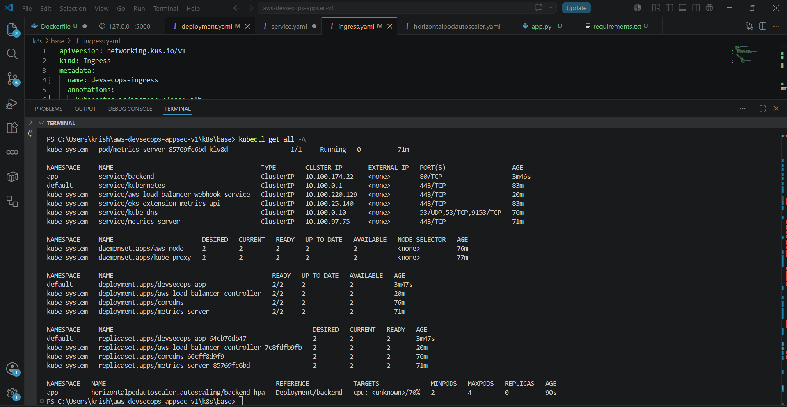
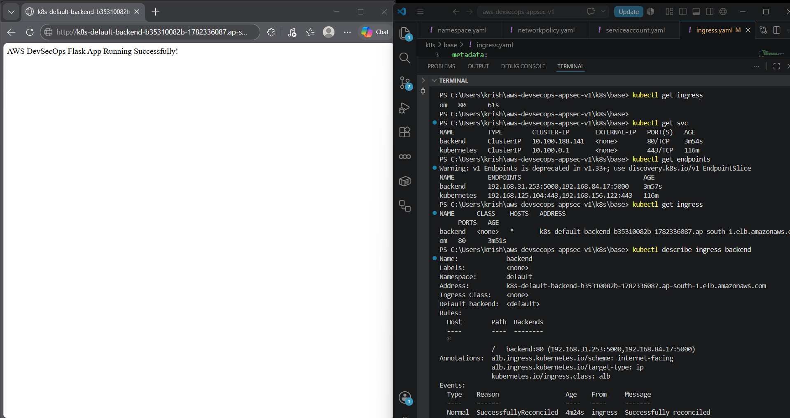
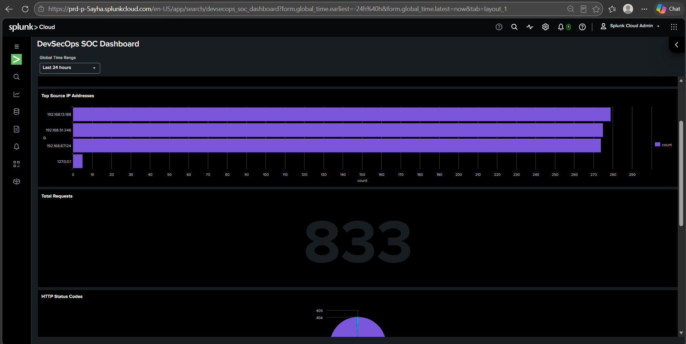
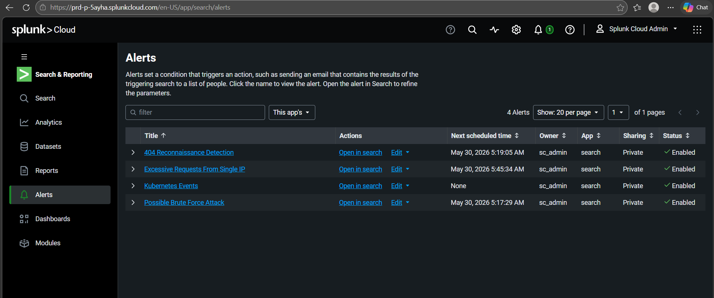
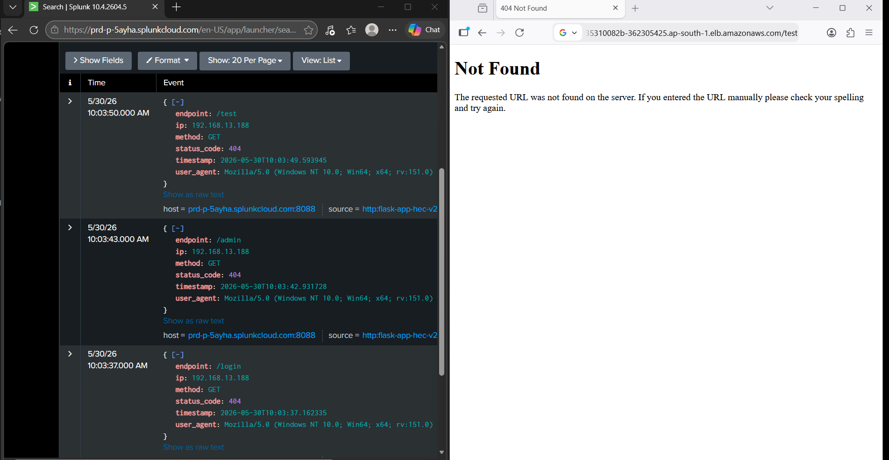

# AWS EKS DevSecOps AppSec + SOC Monitoring Platform

> **Portfolio project:** Secure CI/CD, container security, Kubernetes deployment, centralized application logging, SOC dashboards, and security alerting on AWS.


## 1. Project Overview

This project demonstrates an end-to-end **DevSecOps + Security Operations (SOC)** workflow for a containerized Flask application.

The implementation combines:

- GitHub source control and GitHub Actions CI/CD
- Docker containerization
- Trivy container vulnerability scanning
- Amazon ECR image storage
- Amazon EKS Kubernetes deployment
- Kubernetes Service and AWS Application Load Balancer
- Flask application telemetry
- Splunk Cloud HTTP Event Collector (HEC)
- SPL-based searches
- SOC dashboards
- Security alerts for reconnaissance, excessive requests, Kubernetes events, and possible brute-force activity

The project was built as a hands-on cloud security lab/portfolio implementation. The screenshots in this repository provide evidence of the implementation stages and troubleshooting process.

## 2. Architecture

The high-level flow is:

```text
Developer
   |
   v
GitHub Repository
   |
   v
GitHub Actions
   |
   +--> Docker Build
   |
   +--> Trivy Security Scan
   |
   v
Amazon ECR
   |
   v
Amazon EKS
   |
   +--> Deployment / Pods
   |
   +--> Service
   |
   +--> Ingress / AWS Load Balancer
   |
   v
Flask Application
   |
   v
Structured JSON Application Logs
   |
   v
Splunk Cloud HEC
   |
   +--> Search / SPL
   +--> SOC Dashboard
   +--> Detection Rules
   +--> Security Alerts
   |
   v
SOC Investigation
```

See the detailed architecture guide in [`docs/01-Architecture.md`](docs/01-Architecture.md).

## 3. Security Architecture


The architecture applies security controls at multiple stages:

| Layer | Control |
|---|---|
| Source | GitHub version control |
| CI/CD | GitHub Actions |
| Build | Docker |
| Supply chain | Trivy vulnerability scanning |
| Registry | Amazon ECR |
| Infrastructure | AWS / Terraform layer |
| Runtime | Kubernetes / EKS |
| Traffic | AWS Load Balancer + Ingress |
| Application | Structured security telemetry |
| SIEM | Splunk Cloud |
| Detection | SPL searches and alerts |
| SOC | Dashboard and investigation workflow |

## 4. Technology Stack

| Area | Technology |
|---|---|
| Cloud | AWS |
| Kubernetes | Amazon EKS |
| Container | Docker |
| Registry | Amazon ECR |
| CI/CD | GitHub Actions |
| IaC | Terraform |
| Vulnerability Scanner | Trivy |
| Application | Python Flask |
| SIEM | Splunk Cloud |
| Log Transport | Splunk HEC |
| Query Language | SPL |
| Monitoring | Splunk dashboards and alerts |

## 5. Repository Structure

```text
AWS-EKS-DevSecOps-AppSec-SOC-Portfolio/
├── README.md
├── docs/
│   ├── 01-Architecture.md
│   ├── 02-Deployment-Guide.md
│   ├── 03-Splunk-Integration.md
│   ├── 04-SOC-Workflow.md
│   ├── 05-Troubleshooting.md
│   ├── 06-Security-Controls.md
│   ├── 07-Cost-Control.md
│   └── 08-Evidence-Map.md
├── assets/
│   ├── architecture-diagram.png
│   ├── github-actions-pipeline.png
│   ├── trivy-image-scan.png
│   ├── eks-cluster-creation.png
│   ├── eks-application-running.png
│   ├── kubernetes-resources.png
│   ├── splunk-cloud-console.png
│   ├── app-splunk-hec-config-redacted.png
│   ├── splunk-receives-app-logs.png
│   ├── splunk-soc-dashboard.png
│   ├── splunk-alerts-overview.png
│   └── ...
└── assets/devsecops-soc-dashboard.pdf
```

## 6. Implementation Phases

### Phase 1 — Application

A Flask application was created and verified locally.



The application returned:

```text
AWS DevSecOps Flask App Running Successfully!
```

### Phase 2 — Docker

The Flask application was containerized.

```bash
docker build -t devsecops-app .
docker run -p 5000:5000 devsecops-app
```

The implementation was verified through a browser on port `5000`.

### Phase 3 — Container Security

Trivy was used to scan the Docker image.



The captured scan reported **104 vulnerabilities** in the Debian-based image at the time of the scan. This value is an implementation snapshot and can change as base images and vulnerability databases change.

The important DevSecOps control is that vulnerability scanning occurs before the artifact is promoted/deployed.

### Phase 4 — CI/CD

GitHub Actions was used to automate the pipeline.



The project evidence shows both an earlier failed workflow and a later successful workflow run. This demonstrates iterative pipeline troubleshooting rather than only documenting the final state.

### Phase 5 — Amazon EKS

An EKS cluster was created and Kubernetes resources were deployed.



The implementation evidence also shows running application pods and Kubernetes resources.



### Phase 6 — Application Exposure

The application was exposed through Kubernetes Ingress and an AWS Application Load Balancer.



The implementation verified the application through the load-balanced endpoint.

### Phase 7 — Splunk Integration

The Flask application generated structured JSON telemetry and sent events to Splunk Cloud using HEC.


> **Security note:** The original evidence contained an HEC token. The public portfolio copy has the credential redacted. Do not publish active HEC tokens, AWS credentials, kubeconfig files, or `.env` files.

### Phase 8 — Log Verification

Splunk received application events and extracted fields such as:

- `endpoint`
- `ip`
- `method`
- `status_code`
- `timestamp`
- `user_agent`


Example event structure:

```json
{
  "endpoint": "/",
  "ip": "127.0.0.1",
  "method": "GET",
  "status_code": 200,
  "timestamp": "2026-05-30T08:51:19.356055",
  "user_agent": "Mozilla/5.0 ..."
}
```

## 7. SOC Dashboard



The captured dashboard contains:

- Global time range
- Total requests
- Top source IP addresses
- HTTP status-code distribution
- Request trend
- Top endpoints

The supplied dashboard evidence showed **833 total requests** in the captured time window.

The dashboard also showed source IP activity from internal/private addresses and localhost, with HTTP `200`, `404`, and `405` activity.

The dashboard is intended to give a SOC analyst a rapid first view of application traffic.

A PDF snapshot of the dashboard is also included:

[`assets/devsecops-soc-dashboard.pdf`](assets/devsecops-soc-dashboard.pdf)

## 8. Security Alerts



The implementation created four enabled alerts:

1. **404 Reconnaissance Detection**
2. **Excessive Requests From Single IP**
3. **Kubernetes Events**
4. **Possible Brute Force Attack**

These detections demonstrate a basic SOC workflow from telemetry collection to alert generation.

## 9. Detection Examples

### 404 Reconnaissance

Repeated requests for paths that do not exist can indicate reconnaissance or endpoint discovery.

The evidence includes requests such as:

```text
/test       -> 404
/admin      -> 404
/login      -> 404
```



### Excessive Requests

A high request count from one source IP can be investigated as:

- automated scanning
- brute-force activity
- application abuse
- load testing
- legitimate automation

The dashboard provides the initial source-IP visibility.

### Possible Brute Force

The project includes a possible brute-force alert and corresponding failed-login telemetry.

Detection should be validated against the actual application context before treating an alert as a confirmed incident.

## 10. SOC Investigation Workflow

```text
1. Alert
   |
2. Validate event
   |
3. Identify source IP
   |
4. Review endpoint / method
   |
5. Review HTTP status
   |
6. Review request frequency
   |
7. Correlate related events
   |
8. Determine benign / suspicious / malicious
   |
9. Contain if required
   |
10. Document findings
```

See [`docs/04-SOC-Workflow.md`](docs/04-SOC-Workflow.md).

## 11. Troubleshooting

The project intentionally documents real implementation problems encountered during development.

Examples include:

- Docker build failed because `requirements.txt` was not available in the build context.
- GitHub Actions initially failed and was subsequently corrected.
- Kubernetes/EKS deployment required iterative verification of pods, services, endpoints and ingress.
- Splunk HEC requests produced protocol errors during HTTP/HTTPS testing.
- PowerShell `Invoke-RestMethod` did not support the attempted `-SkipCertificateCheck` parameter in the installed environment.
- Splunk returned an `Invalid token` response during one integration test.
- Splunk ultimately received application events successfully.

See [`docs/05-Troubleshooting.md`](docs/05-Troubleshooting.md).

## 12. Security Lessons

### Shift-left security

The image is scanned before deployment.

### Centralized visibility

Application events are sent to a central SIEM instead of relying only on local application output.

### Detection engineering

The project converts raw application telemetry into:

```text
Events -> SPL -> Detection -> Alert -> Investigation
```

### Secrets management

The initial implementation used a token directly in application configuration. The production-ready improvement is:

```text
Application
    |
Environment Variable / Secret Manager
    |
Splunk HEC Token
```

Never commit secrets to GitHub.

## 13. Cost Management

For a learning environment, EKS and associated AWS resources can generate ongoing costs.

Before ending a lab session:

```bash
kubectl delete ingress --all
```

Then verify AWS load balancers and other provisioned resources.

When the cluster is no longer required, delete the EKS environment using the method used to create it, and verify that related resources such as load balancers, node groups, NAT gateways, and unused Elastic IPs are removed.

See [`docs/07-Cost-Control.md`](docs/07-Cost-Control.md).

## 14. Portfolio Evidence

The repository includes evidence from the following stages:

| Evidence | Demonstrates |
|---|---|
| Architecture diagram | End-to-end design |
| Local Flask screenshot | Application validation |
| Docker troubleshooting | Container build debugging |
| EKS creation | Cloud Kubernetes provisioning |
| Kubernetes resources | Runtime deployment |
| CI/CD screenshot | GitHub Actions |
| Trivy scan | Supply-chain security |
| Splunk Cloud console | SIEM environment |
| HEC configuration | Application-to-SIEM integration |
| Splunk event search | Log ingestion |
| SOC dashboard | Security visibility |
| Alert page | Detection engineering |
| 404 evidence | Reconnaissance telemetry |
| PDF dashboard | Portfolio-ready dashboard evidence |

## 15. Important Security Disclaimer

This project is an educational and portfolio implementation.

The security testing and simulated detections should only be performed against systems you own or have explicit authorization to test.

Before publishing the repository:

- rotate any exposed HEC token
- remove AWS access keys
- remove `.env` files
- remove kubeconfig files
- remove private IP information if unnecessary
- review Git history for credentials
- enable secret scanning

## 16. Future Improvements

Recommended next steps:

- Add SAST with Semgrep or SonarQube
- Add DAST with OWASP ZAP
- Add dependency scanning
- Enforce Trivy severity thresholds in CI/CD
- Use AWS Secrets Manager or Kubernetes Secrets with a secure external secret workflow
- Add Prometheus/Grafana metrics
- Add AWS CloudTrail/GuardDuty/Security Hub telemetry
- Add incident enrichment and automated response
- Replace Flask development server with Gunicorn
- Add TLS and hardened ingress configuration
- Add signed container images and provenance/attestation

## 17. Project Outcome

The completed implementation demonstrates the full lifecycle:

```text
Code
  ↓
Build
  ↓
Scan
  ↓
Store
  ↓
Deploy
  ↓
Run
  ↓
Collect
  ↓
Detect
  ↓
Investigate
```

This makes the project suitable as a portfolio demonstration of **AWS, Kubernetes, DevSecOps, container security, SIEM integration, and SOC detection engineering**.
