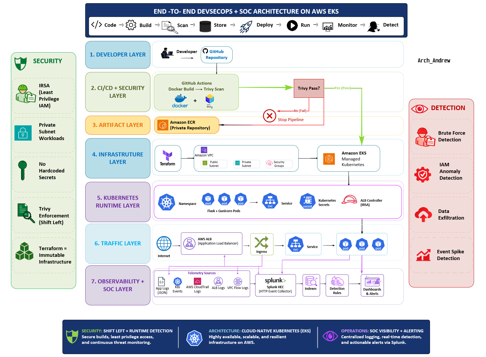

# 01 — Architecture Guide

## Objective

The architecture connects secure software delivery with runtime security monitoring.



## Layer 1 — Developer

The developer pushes application source code to GitHub.

```text
Developer
   |
   v
GitHub Repository
```

## Layer 2 — CI/CD + Security

GitHub Actions performs the build workflow.

```text
GitHub
  |
  v
GitHub Actions
  |
  +--> Docker Build
  |
  +--> Trivy Scan
  |
  v
Artifact
```

The implementation evidence shows an earlier workflow failure followed by a successful GitHub Actions run.

## Layer 3 — Artifact

The container image is stored in Amazon ECR.

```text
Trivy-approved image
        |
        v
Amazon ECR
```

## Layer 4 — Infrastructure

AWS provides the network and compute foundation.

The architecture evidence includes a Terraform layer and AWS VPC concepts such as public/private subnets and security groups.

```text
Terraform
   |
   v
AWS VPC
   |
   v
Amazon EKS
```

## Layer 5 — Kubernetes Runtime

The application runs as Kubernetes pods behind a Service.

```text
Deployment
   |
   +--> Pod
   +--> Pod
   |
   v
Service
```

The implementation evidence shows two application pods in the running state.

## Layer 6 — Traffic

The application is exposed using Kubernetes Ingress and an AWS Application Load Balancer.

```text
Internet
   |
   v
AWS ALB
   |
   v
Ingress
   |
   v
Kubernetes Service
   |
   v
Application Pods
```

## Layer 7 — Observability + SOC

The application produces JSON security telemetry.

```text
Flask
  |
  v
JSON Event
  |
  v
Splunk HEC
  |
  +--> Index
  |
  +--> SPL Search
  |
  +--> Dashboard
  |
  +--> Detection Rules
  |
  v
SOC Alert
```

## Security Design

The architecture applies security controls at different points:

| Layer | Security objective |
|---|---|
| Source | Version control |
| CI/CD | Automated security checks |
| Image | Vulnerability detection |
| Registry | Controlled artifact storage |
| IAM | Least privilege |
| Kubernetes | Runtime isolation |
| Network | Controlled traffic |
| Application | Security telemetry |
| SIEM | Centralized visibility |
| Detection | Alert generation |

## Data Flow

1. Developer commits code.
2. GitHub Actions builds the container.
3. Trivy scans the image.
4. The image is promoted to ECR.
5. EKS runs the workload.
6. ALB exposes the application.
7. Flask generates structured events.
8. Events are submitted to Splunk HEC.
9. Splunk indexes the events.
10. SPL searches transform events into detections.
11. Dashboards provide visibility.
12. Alerts initiate SOC investigation.

## Architecture Evidence


The diagram supplied with the project explicitly represents the DevSecOps, Kubernetes, traffic, observability and detection layers.
