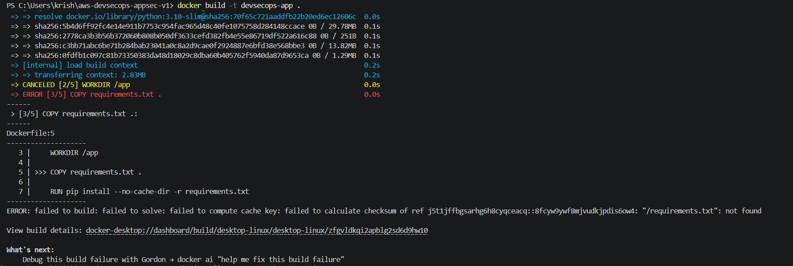

# 02 — Deployment Guide

## 1. Prerequisites

Install and configure:

- Git
- Docker Desktop
- Python
- AWS CLI
- kubectl
- eksctl
- Terraform
- GitHub account
- AWS account
- Splunk Cloud account

Verify tools:

```bash
git --version
docker --version
python --version
aws --version
kubectl version --client
eksctl version
terraform version
trivy --version
```

## 2. Configure AWS CLI

```bash
aws configure
```

Verify:

```bash
aws sts get-caller-identity
```

The project evidence shows successful identity verification before AWS operations.

## 3. Run the Flask Application Locally

From the project directory:

```bash
python app.py
```

Expected:

```text
Running on http://127.0.0.1:5000
```

The local application was verified through a browser.


## 4. Build the Docker Image

```bash
docker build -t devsecops-app .
```

Run:

```bash
docker run -p 5000:5000 devsecops-app
```

Open:

```text
http://127.0.0.1:5000
```

## 5. Docker Troubleshooting Encountered

One captured build failed because Docker could not find:

```text
requirements.txt
```

The error was:

```text
failed to calculate checksum ...
"/requirements.txt": not found
```

The fix was to ensure that `requirements.txt` exists in the Docker build context and that the Dockerfile references the correct path.

The project evidence also shows a successful container run after the build issue was resolved.



## 6. Run Trivy

```bash
trivy image devsecops-app:latest
```

The captured scan reported:

```text
104 vulnerabilities
```

This is a snapshot from the image/database state at scan time and should not be treated as a permanent vulnerability count.


## 7. Create EKS Cluster

The project used `eksctl` to create the EKS environment.

A typical command is:

```bash
eksctl create cluster
```

The actual cluster configuration should be adapted to the AWS account, region, node size and cost requirements.


## 8. Verify Cluster

```bash
kubectl get nodes
kubectl get pods
kubectl get svc
kubectl get ingress
```

The implementation evidence shows running application pods and Kubernetes resources.


## 9. Deploy Kubernetes Resources

Apply resources in dependency order:

```bash
kubectl apply -f k8s/
```

Verify:

```bash
kubectl get all
kubectl get endpoints
kubectl get ingress
```

The project evidence shows the application Service and pods becoming available.

## 10. Verify Application

Use the ALB hostname returned by:

```bash
kubectl get ingress
```

Then browse to the endpoint.


## 11. GitHub Actions

Push the project to GitHub and configure repository secrets/variables according to the workflow.

The captured GitHub Actions evidence shows:

- an initial failed workflow
- a later successful CI/CD workflow


## 12. Important GitHub Security Rule

Never commit:

```text
.env
AWS credentials
HEC tokens
kubeconfig
private keys
certificates
```

Use `.gitignore` and GitHub repository secrets.

## 13. Splunk

The application was configured to send structured events to Splunk Cloud HEC.

The configuration evidence has been redacted in this portfolio repository.


Continue with [`03-Splunk-Integration.md`](03-Splunk-Integration.md).
