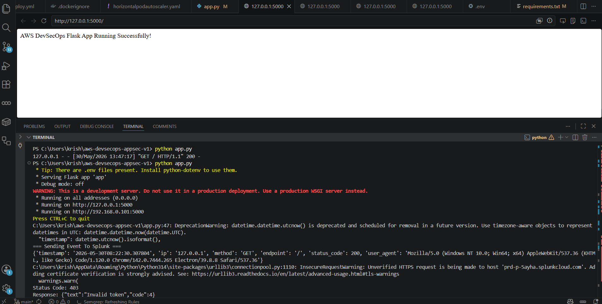
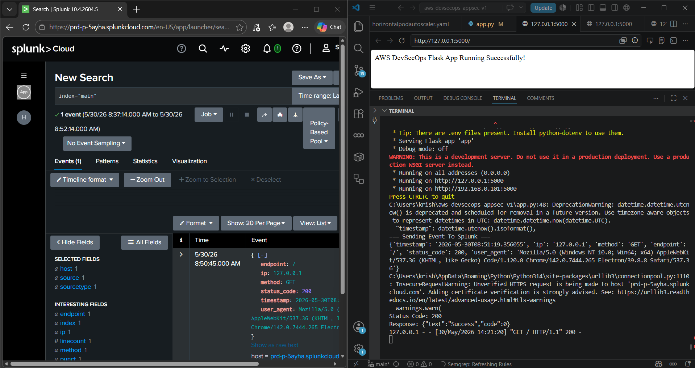
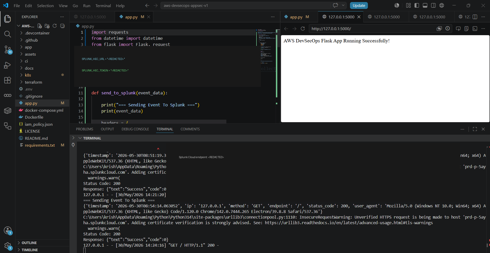

# 03 — Splunk Integration Guide

## Objective

Send application telemetry from Flask to Splunk Cloud using the HTTP Event Collector (HEC).

## Data Flow

```text
Flask Application
       |
       | HTTPS
       v
Splunk HEC
       |
       v
Splunk Index
       |
       v
SPL Search
       |
       v
Dashboard / Alert
```

## Event Structure

The application generated JSON events similar to:

```json
{
  "timestamp": "2026-05-30T08:51:19.356055",
  "ip": "127.0.0.1",
  "method": "GET",
  "endpoint": "/",
  "status_code": 200,
  "user_agent": "Mozilla/5.0 ..."
}
```

## Fields Used

| Field | Purpose |
|---|---|
| timestamp | Event time |
| ip | Source address |
| method | HTTP method |
| endpoint | Requested resource |
| status_code | HTTP response |
| user_agent | Client information |

## Application Integration

The application uses the Python `requests` library to submit events.

A production-safe implementation should read the endpoint and token from environment variables:

```python
import os

SPLUNK_HEC_URL = os.environ["SPLUNK_HEC_URL"]
SPLUNK_HEC_TOKEN = os.environ["SPLUNK_HEC_TOKEN"]
```

Do not hardcode the token.

## HEC Header

The request uses:

```text
Authorization: Splunk <HEC_TOKEN>
```

The actual token is intentionally excluded from this documentation.

## Evidence — Application Sending Events



The captured troubleshooting output includes both successful and failed HEC responses during development.

## Evidence — Splunk Receiving Events



Splunk successfully displayed application events with extracted fields.

## Search Validation

A basic validation search can be:

```spl
index="main"
```

Field-focused searches can then be built:

```spl
index="main" status_code=404
```

```spl
index="main" status_code=200
```

```spl
index="main" | stats count by ip
```

```spl
index="main" | stats count by endpoint
```

## HEC Troubleshooting

During implementation, multiple connection tests were attempted.

### Protocol violation

PowerShell returned a response-status-line protocol error.

This indicates that the client and endpoint/protocol combination needed to be corrected.

### curl HTTP/0.9 error

One HTTP test produced:

```text
Received HTTP/0.9 when not allowed
```

The test was not using the correct endpoint/protocol combination.

### Invalid token

The application later produced:

```text
Status Code: 403
Response: {"text":"Invalid token","code":4}
```

This confirmed that the endpoint was reachable but the supplied HEC credential was not accepted.

### Successful ingestion

After correcting the integration, the application received:

```text
Status Code: 200
Response: {"text":"Success","code":0}
```

and events appeared in Splunk.

## Certificate Warning

Development testing also produced an `InsecureRequestWarning` when certificate verification was disabled.

Production systems should use certificate verification and should not permanently disable TLS validation.

## Security Recommendation

If the original HEC token used during the lab is still active, rotate/revoke it before publishing the project.

The portfolio screenshot has been redacted.


